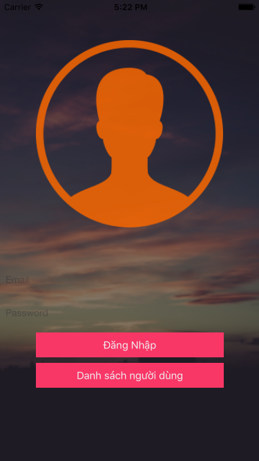

#Bài tập lớn kiểm thử
======
Phần mềm của t là 1 app đăng nhập max cmn đơn giản.
Điền email, pass rồi ấn login
1. Lên kế hoạch: Thì mình sẽ lên kế hoạch kiểm thử gồm cả hộp đen và trắng rồi áp dụng

2. Kiểm thử hộp đen ( ***mỗi đứa chọn 1 cái nhé*** )

3. Kiểm thử hộp trắng

4. Công cụ: KIF : cái này kiểm thử hộp đen trên iPhone của **Quỳnh** :laughing: (**Thành** làm cái này)

Còn slide:
1. 15-20 trang báo cáo (**Thành**, **Quỳnh**)

* Mô tả phần mềm

* Kế hoạch kiểm thử

* Test-cases

* Kết quả kiểm thử.

2. 10-15 trang slides báo cáo. (**Long** làm nhé)

Giao diện app sẽ kiểu như thế này.

